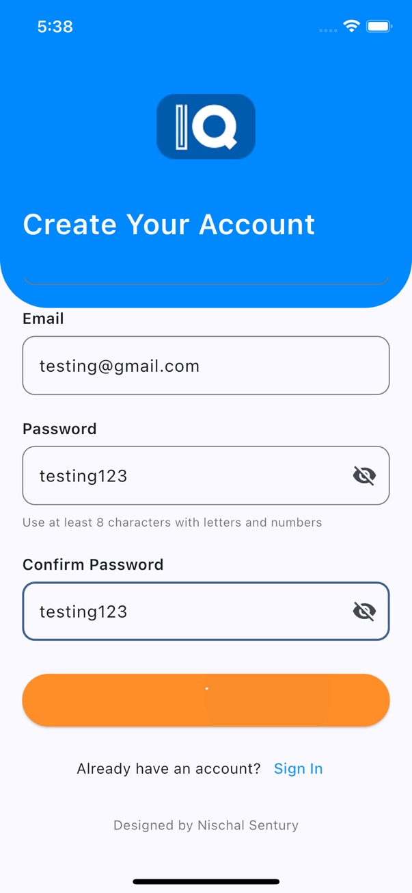
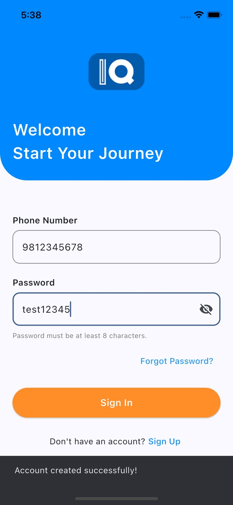
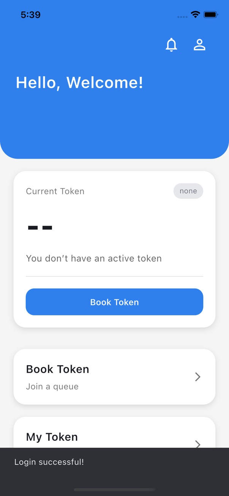
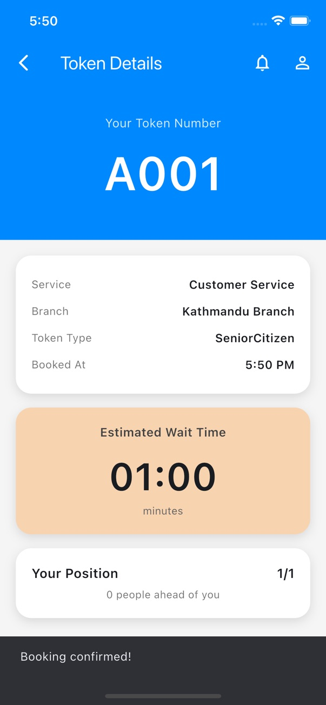
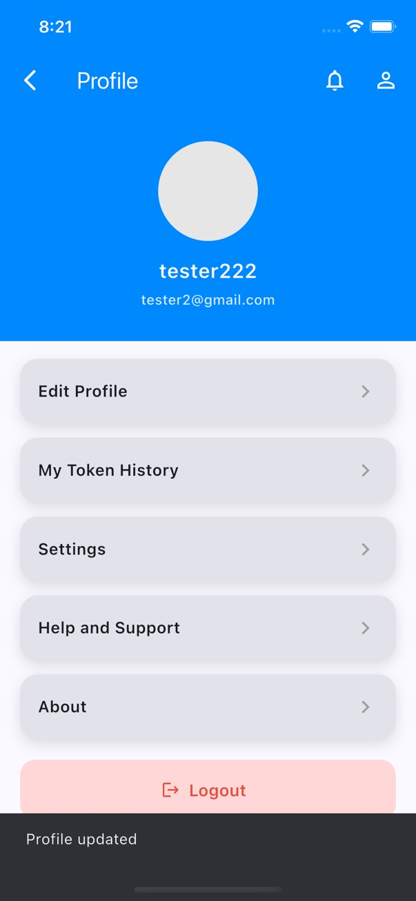
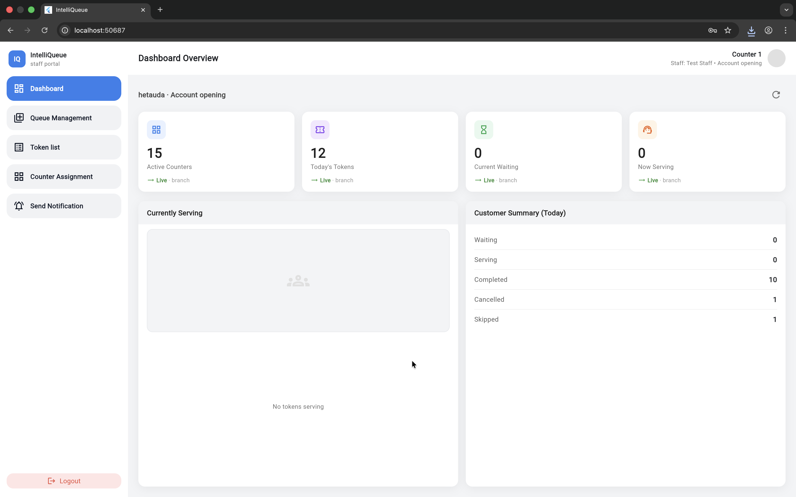
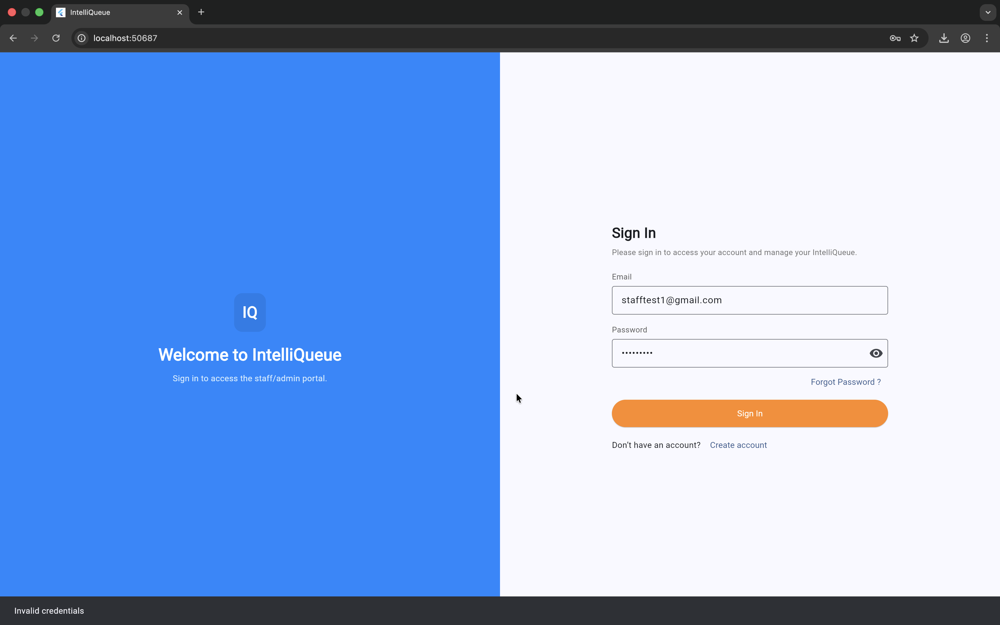
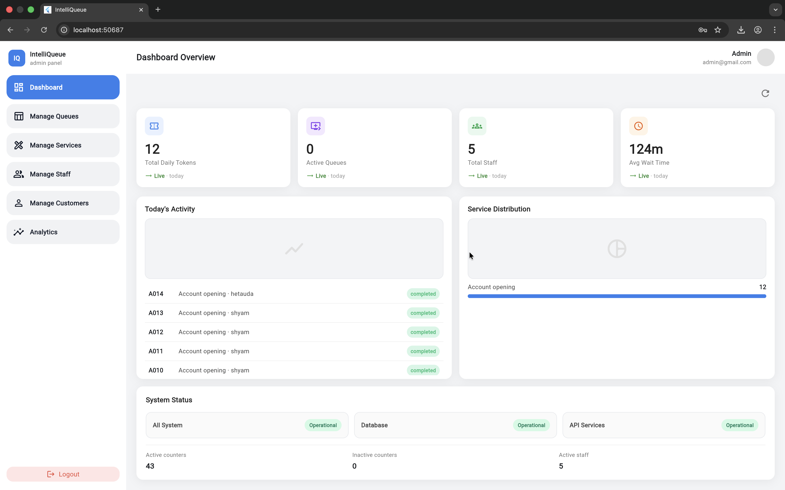
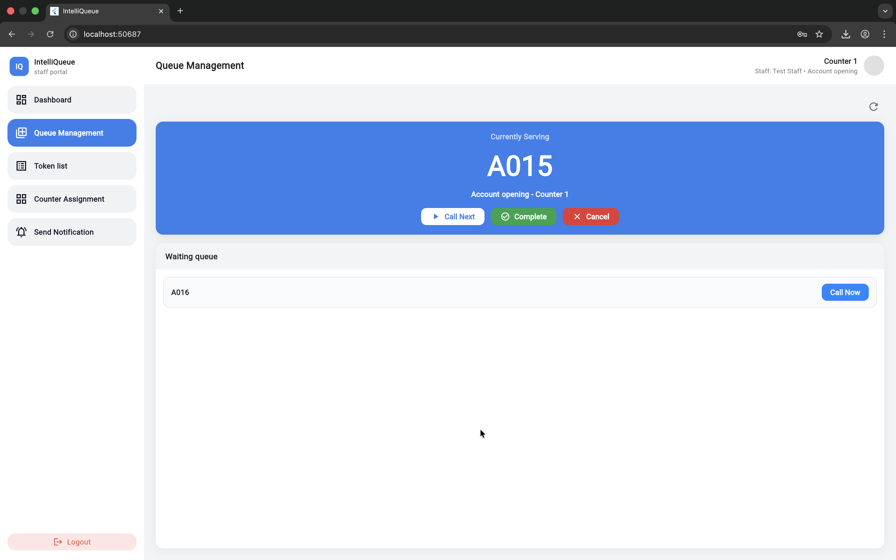
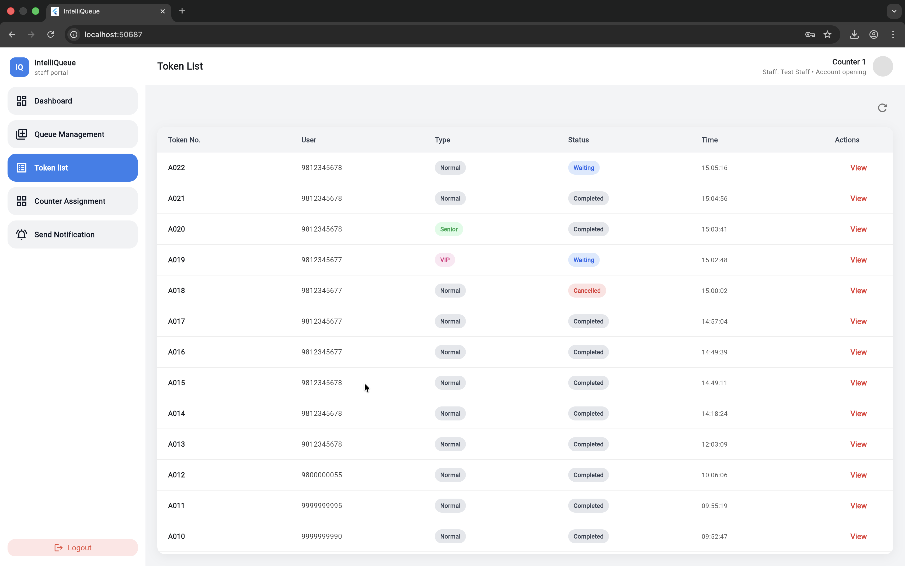

# 🧠 IntelliQueue — Smart Queue Management System

IntelliQueue is a full-stack smart queue management system designed to reduce physical waiting time and improve service efficiency by digitizing token booking, queue tracking, and staff management.

Built using **Flutter (Frontend)** and **FastAPI (Backend)**, it supports real-time queue updates, role-based access, and analytics for better service flow.

---

## 🚀 Features

### 👤 Customer Module
- Digital token booking system
- Select branch and service type
- Live queue status tracking
- Estimated waiting time updates
- View booking history

### 🧑‍💼 Staff Module
- Manage active queue in real time
- Call next customer
- Mark service completion
- View current workload

### 🧑‍💻 Admin Dashboard
- Manage branches and services
- Add / remove staff and customers
- Monitor queue performance
- View analytics and reports

---

## ⚡ Core Functionality

- Real-time queue updates
- Token-based system replacing manual queues
- Role-based access control (Admin / Staff / Customer)
- Efficient service flow optimization
- Backend API integration with FastAPI

---

## 🛠️ Tech Stack

### Frontend
- Flutter
- Dart
- State Management (Provider / Bloc if used)

### Backend
- FastAPI (Python)
- REST API architecture
- PostgreSQL / SQLite (if used)

### Others
- WebSocket / Real-time updates (if implemented)
- JSON-based API communication

---

## 📱 System Flow

1. Customer selects service → gets token
2. System assigns queue position
3. Staff manages queue in real time
4. Admin monitors system performance
5. Notifications / updates sent to users

---

## 📊 Key Benefits

- Reduces physical waiting time
- Improves service efficiency
- Transparent queue system
- Easy scalability for businesses
- Reduces manual errors

---

## 📸 Screenshots

